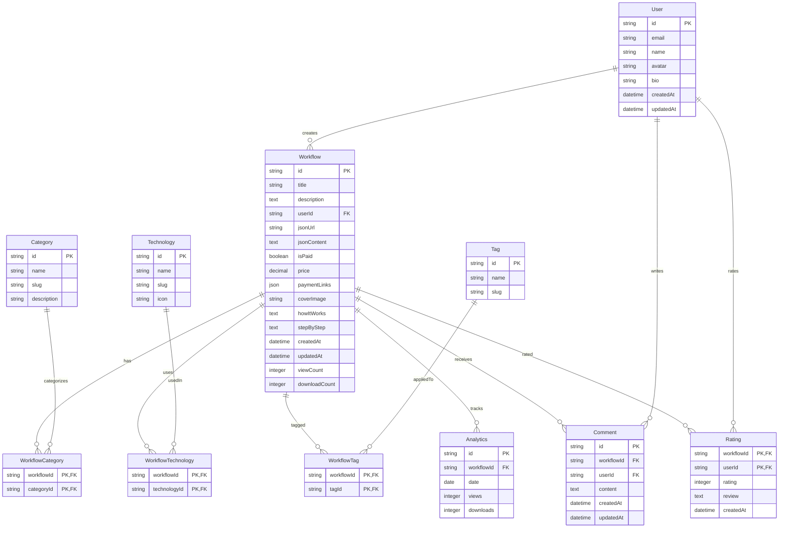

# Design Document: N8N Workflow Marketplace (wrkflow)

## Overview

The N8N Workflow Marketplace (wrkflow) is a platform for sharing, discovering, and monetizing N8N automation workflows. This design document outlines the architecture, components, data models, and implementation strategies for building the platform based on the requirements.

The platform will be built using Next.js with a clean, minimalistic UI powered by shadcn components. Data will be managed using Drizzle ORM with Turso SQLite DB, and authentication will be handled by StackAuth. The platform will be deployed to wrkflow.skechflow.space.

## Architecture

### High-Level Architecture

The application follows a modern web application architecture with the following key components:

1. **Frontend**: Next.js application with React components
2. **API Layer**: Next.js API routes for server-side operations
3. **Database**: Turso SQLite DB with Drizzle ORM
4. **Authentication**: StackAuth integration
5. **Storage**: For workflow JSON files and images

### Application Flow

1. Users authenticate via StackAuth
2. Creators publish workflows with metadata and JSON content
3. Users discover workflows through browsing, searching, and filtering
4. Users download free workflows or purchase paid ones
5. Analytics track views and downloads for creators

## Components and Interfaces

### Core Components

1. **Authentication Components**
   - Login/Register forms
   - Profile management
   - Session handling

2. **Workflow Management Components**
   - Workflow creation/editing form
   - Markdown editor for documentation
   - JSON input (URL or direct paste)
   - Payment integration setup

3. **Marketplace Components**
   - Workflow listing with filtering and sorting
   - Search functionality
   - Category navigation
   - Featured workflows section

4. **Workflow Detail Components**
   - Workflow preview
   - Documentation display
   - Download/Purchase buttons
   - Related workflows

5. **Dashboard Components**
   - Analytics visualization
   - Workflow management interface
   - User statistics

### Page Structure

1. **Public Pages**
   - Home/Landing Page
   - Workflow Listing/Search Page
   - Workflow Detail Page
   - Category Pages
   - About/FAQ Pages

2. **Authenticated Pages**
   - User Dashboard
   - Workflow Creation/Editing Page
   - Profile Management Page
   - Analytics Page

### UI/UX Design Principles

1. **Clean and Minimalistic**
   - Focus on content with ample whitespace
   - Clear typography hierarchy
   - Consistent component styling

2. **Color System**
   - Define all colors as CSS variables in global.css
   - Create a cohesive color palette with primary, secondary, and accent colors
   - Ensure sufficient contrast for accessibility

3. **Component Library**
   - Utilize shadcn components for consistent UI elements
   - Extend components as needed while maintaining design consistency
   - Create reusable custom components for workflow-specific UI elements

4. **Responsive Design**
   - Mobile-first approach
   - Adaptive layouts for different screen sizes
   - Touch-friendly interface elements

## Data Models

### Core Data Models

#### User
- id: string (primary key)
- email: string (unique)
- name: string
- avatar: string (optional)
- bio: string (optional)
- createdAt: datetime
- updatedAt: datetime

#### Workflow
- id: string (primary key)
- title: string
- description: text
- userId: string (foreign key to User)
- jsonUrl: string (optional)
- jsonContent: text (optional)
- isPaid: boolean
- price: decimal (optional)
- paymentLinks: json (optional)
- coverImage: string (optional)
- howItWorks: text (optional)
- stepByStep: text (optional)
- createdAt: datetime
- updatedAt: datetime
- viewCount: integer
- downloadCount: integer

#### Category
- id: string (primary key)
- name: string
- slug: string (unique)
- description: string (optional)

#### WorkflowCategory (Junction Table)
- workflowId: string (foreign key to Workflow)
- categoryId: string (foreign key to Category)
- primary key: (workflowId, categoryId)

#### Technology
- id: string (primary key)
- name: string
- slug: string (unique)
- icon: string (optional)

#### WorkflowTechnology (Junction Table)
- workflowId: string (foreign key to Workflow)
- technologyId: string (foreign key to Technology)
- primary key: (workflowId, technologyId)

#### Tag
- id: string (primary key)
- name: string
- slug: string (unique)

#### WorkflowTag (Junction Table)
- workflowId: string (foreign key to Workflow)
- tagId: string (foreign key to Tag)
- primary key: (workflowId, tagId)

#### Analytics
- id: string (primary key)
- workflowId: string (foreign key to Workflow)
- date: date
- views: integer
- downloads: integer

#### Comment
- id: string (primary key)
- workflowId: string (foreign key to Workflow)
- userId: string (foreign key to User)
- content: text
- createdAt: datetime
- updatedAt: datetime

#### Rating
- workflowId: string (foreign key to Workflow)
- userId: string (foreign key to User)
- rating: integer (1-5)
- review: text (optional)
- createdAt: datetime
- primary key: (workflowId, userId)

### Database Schema

## Error Handling

### Error Types

1. **Authentication Errors**
   - Invalid credentials
   - Session expiration
   - Unauthorized access

2. **Validation Errors**
   - Form validation failures
   - Invalid workflow JSON
   - Missing required fields

3. **Database Errors**
   - Connection issues
   - Query failures
   - Constraint violations

4. **API Errors**
   - Rate limiting
   - External service failures
   - Timeout issues

### Error Handling Strategy

1. **Client-Side Error Handling**
   - Form validation with immediate feedback
   - Error boundaries for component failures
   - Toast notifications for user-friendly error messages

2. **Server-Side Error Handling**
   - Structured error responses with status codes
   - Detailed logging for debugging
   - Graceful fallbacks for critical operations

3. **Error Reporting**
   - Capture and log errors for analysis
   - Provide clear error messages to users
   - Implement retry mechanisms where appropriate

## Testing Strategy

### Testing Levels

1. **Unit Testing**
   - Test individual components and functions
   - Validate business logic
   - Ensure data model integrity

2. **Integration Testing**
   - Test API endpoints
   - Validate database operations
   - Verify authentication flows

3. **End-to-End Testing**
   - Test complete user journeys
   - Validate critical workflows
   - Ensure cross-browser compatibility

### Testing Tools and Approaches

1. **Testing Libraries**
   - Jest for unit and integration tests
   - React Testing Library for component tests
   - Cypress for end-to-end tests

2. **Test Coverage**
   - Aim for high coverage of critical paths
   - Regular test runs in CI/CD pipeline
   - Automated regression testing

## SEO Strategy

### On-Page SEO

1. **Metadata Optimization**
   - Dynamic page titles and descriptions
   - Structured data for workflows
   - Open Graph and Twitter card metadata

2. **Content Structure**
   - Semantic HTML structure
   - Proper heading hierarchy
   - Alt text for images

3. **Performance Optimization**
   - Server-side rendering for critical pages
   - Image optimization
   - Code splitting and lazy loading

### Technical SEO

1. **Sitemap Generation**
   - Dynamic sitemap for all pages
   - Regular updates for new content

2. **URL Structure**
   - Clean, descriptive URLs
   - Proper handling of redirects

3. **Performance Metrics**
   - Optimize Core Web Vitals
   - Minimize loading times
   - Ensure mobile responsiveness

## Security Considerations

1. **Authentication Security**
   - Secure session management
   - Protection against common attacks (CSRF, XSS)
   - Rate limiting for login attempts

2. **Data Security**
   - Input validation and sanitization
   - Protection against SQL injection
   - Secure storage of sensitive information

3. **API Security**
   - Authentication for all protected endpoints
   - Rate limiting to prevent abuse
   - Proper error handling to avoid information leakage

## Deployment Strategy

1. **Hosting**
   - Deploy to wrkflow.skechflow.space
   - Configure proper SSL/TLS
   - Set up CDN for static assets

2. **CI/CD Pipeline**
   - Automated testing before deployment
   - Staged deployments (dev, staging, production)
   - Rollback capability for failed deployments

3. **Monitoring and Maintenance**
   - Performance monitoring
   - Error tracking
   - Regular security updates

## Additional Features for Future Consideration

1. **Workflow Versioning**
   - Track changes to workflows
   - Allow users to access previous versions

2. **Workflow Templates**
   - Starter templates for common use cases
   - Template marketplace

3. **Integration Testing Environment**
   - Sandbox for testing workflows before download
   - Preview functionality

4. **Subscription Model**
   - Premium membership with additional features
   - Subscription-based access to premium workflows

5. **API Access**
   - Public API for programmatic access
   - Developer tools and documentation