# Architecture & Tech Stack

## 🏗️ High-Level Architecture

wrkflow follows a modern, serverless-first architecture designed for scalability, performance, and maintainability.

```mermaid
graph TB
    User[👤 User] --> CloudFlare[☁️ Cloudflare Edge]
    CloudFlare --> NextJS[⚛️ Next.js Application]
    
    NextJS --> API[🔌 API Routes]
    NextJS --> Auth[🔐 StackAuth]
    NextJS --> SSR[🖥️ Server-Side Rendering]
    
    API --> Drizzle[🗄️ Drizzle ORM]
    Drizzle --> D1[💾 Cloudflare D1 Database]
    
    NextJS --> R2[📁 Cloudflare R2 Storage]
    
    subgraph "Frontend Layer"
        NextJS
        SSR
        UI[🎨 shadcn/ui Components]
        TailwindCSS[🎨 Tailwind CSS]
    end
    
    subgraph "Backend Layer"
        API
        Drizzle
        Auth
    end
    
    subgraph "Data Layer"
        D1
        R2
    end
    
    subgraph "External Services"
        StackAuth[🔐 StackAuth Service]
        GitHub[📦 GitHub (JSON URLs)]
        CDN[🌐 CDN (Images)]
    end
    
    Auth --> StackAuth
    API --> GitHub
    NextJS --> CDN
```

## 🛠️ Technology Stack

### Frontend Technologies

#### **Next.js 15** 
- **Version**: 15.3.5
- **Features Used**:
  - App Router (app directory)
  - Server-Side Rendering (SSR)
  - Client-Side Rendering (CSR)
  - API Routes
  - Middleware
  - Dynamic Imports
  - Image Optimization
- **Configuration**: Custom next.config.ts with Cloudflare optimizations

#### **React 19**
- **Version**: 19.0.0
- **Features**:
  - Functional Components with Hooks
  - Context API for state management
  - Suspense for loading states
  - Error Boundaries
  - Server Components (where applicable)

#### **TypeScript**
- **Version**: 5.x
- **Configuration**: Strict mode enabled
- **Features**:
  - Type-safe API calls
  - Component prop typing
  - Database schema typing with Drizzle
  - Utility type definitions

#### **Tailwind CSS 4**
- **Styling Framework**: Utility-first CSS
- **Configuration**: Custom design system
- **Features**:
  - Responsive design utilities
  - Dark mode support
  - Custom color palette
  - Animation utilities

#### **shadcn/ui**
- **Component Library**: Pre-built, accessible components
- **Based on**: Radix UI primitives
- **Customization**: Tailwind CSS theming
- **Components Used**:
  - Forms and inputs
  - Navigation components
  - Layout components
  - Data display components

### Backend Technologies

#### **Next.js API Routes**
- **Architecture**: Serverless functions
- **Features**:
  - RESTful API endpoints
  - Middleware support
  - Request/Response handling
  - Error handling
- **Endpoints**:
  - `/api/workflows` - CRUD operations
  - `/api/categories` - Category management
  - `/api/auth/*` - Authentication routes

#### **Drizzle ORM**
- **Version**: 0.44.3
- **Features**:
  - Type-safe database queries
  - Schema definition
  - Migration management
  - HTTP driver for D1
- **Configuration**: Drizzle Kit for migrations

### Database & Storage

#### **Cloudflare D1**
- **Type**: SQLite-based serverless database
- **Features**:
  - Global distribution
  - HTTP API access
  - Automatic scaling
  - ACID transactions
- **Configuration**:
  - Development DB: `3f5e54bf-b024-43ac-9061-cd14bb018101`
  - Production DB: `101bf744-d0ac-4832-b6b2-e56eabbebe31`

#### **Cloudflare R2** (Planned)
- **Type**: Object storage
- **Use Cases**:
  - Workflow images
  - User avatars
  - Static assets

### Authentication

#### **StackAuth**
- **Type**: Authentication-as-a-Service
- **Features**:
  - User registration/login
  - Session management
  - Social login (planned)
  - User profile management
- **Integration**: React hooks and server-side utilities

### Development Tools

#### **Build Tools**
- **Turbopack**: Next.js 15 bundler for development
- **ESLint**: Code linting with Next.js configuration
- **TypeScript Compiler**: Type checking

#### **Database Tools**
- **Drizzle Kit**: Schema management and migrations
- **Drizzle Studio**: Database visual interface
- **Wrangler**: Cloudflare CLI for D1 operations

#### **Development Environment**
- **Node.js**: 18+ required
- **Package Manager**: npm
- **Environment Variables**: .env.local and .dev.vars

## 🗂️ Project Structure

```
wrkflow/
├── 📁 src/                          # Source code
│   ├── 📁 app/                      # Next.js App Router
│   │   ├── 📁 api/                  # API Routes
│   │   │   ├── 📁 workflows/        # Workflow CRUD endpoints
│   │   │   ├── 📁 categories/       # Category endpoints
│   │   │   ├── 📁 auth/             # Authentication endpoints
│   │   │   └── 📁 debug-env/        # Environment debugging
│   │   ├── 📁 workflows/            # Workflow pages
│   │   │   ├── page.tsx             # Marketplace listing
│   │   │   ├── page-client.tsx      # Client-side components
│   │   │   ├── 📁 new/              # Create workflow
│   │   │   └── 📁 [id]/             # Individual workflow
│   │   ├── 📁 dashboard/            # User dashboard
│   │   ├── 📁 profile/              # User profile
│   │   ├── 📁 auth/                 # Auth pages
│   │   ├── 📁 handler/              # StackAuth handlers
│   │   ├── layout.tsx               # Root layout
│   │   ├── page.tsx                 # Home page
│   │   ├── globals.css              # Global styles
│   │   ├── sitemap.ts               # SEO sitemap
│   │   └── robots.ts                # SEO robots
│   ├── 📁 components/               # React Components
│   │   ├── 📁 ui/                   # shadcn/ui components
│   │   ├── 📁 layout/               # Layout components
│   │   └── 📁 auth/                 # Auth components
│   ├── 📁 lib/                      # Utilities & Libraries
│   │   ├── 📁 db/                   # Database config & schema
│   │   ├── auth.ts                  # Auth utilities
│   │   ├── constants.ts             # App constants
│   │   ├── utils.ts                 # General utilities
│   │   └── user-sync.ts             # User synchronization
│   ├── 📁 hooks/                    # Custom React hooks
│   ├── middleware.ts                # Next.js middleware
│   └── stack.tsx                    # StackAuth configuration
├── 📁 drizzle/                      # Database migrations
├── 📁 public/                       # Static assets
├── 📁 docs/                         # Documentation
├── 📄 package.json                  # Dependencies & scripts
├── 📄 drizzle.config.ts             # Database configuration
├── 📄 next.config.ts                # Next.js configuration
├── 📄 tailwind.config.ts            # Tailwind configuration
├── 📄 tsconfig.json                 # TypeScript configuration
└── 📄 wrangler.jsonc                # Cloudflare configuration
```

## 🔌 API Architecture

### RESTful Design
The API follows REST principles with consistent patterns:

```
GET    /api/workflows              # List workflows with filtering
POST   /api/workflows              # Create new workflow
GET    /api/workflows/[id]         # Get specific workflow
PUT    /api/workflows/[id]         # Update specific workflow
DELETE /api/workflows/[id]         # Delete specific workflow

GET    /api/categories             # List categories
POST   /api/categories             # Create category

GET    /api/auth/user              # Get current user
POST   /api/auth/sync              # Sync user to database
```

### Request/Response Format
```typescript
// Standard Response Format
interface APIResponse<T> {
  success: boolean;
  data?: T;
  error?: string;
  pagination?: {
    page: number;
    limit: number;
    total: number;
    totalPages: number;
    hasNext: boolean;
    hasPrev: boolean;
  };
}
```

### Error Handling
- **400**: Bad Request (validation errors)
- **401**: Unauthorized (authentication required)
- **403**: Forbidden (insufficient permissions)
- **404**: Not Found (resource doesn't exist)
- **500**: Internal Server Error (system errors)

## 🛡️ Security Architecture

### Authentication Flow


### Security Measures
1. **Authentication**: StackAuth with secure sessions
2. **Authorization**: Route-level protection with middleware
3. **Data Validation**: Input validation on both client and server
4. **SQL Injection Prevention**: Parameterized queries with Drizzle
5. **XSS Prevention**: React's built-in XSS protection
6. **CSRF Protection**: Same-origin policy enforcement

## 🚀 Performance Architecture

### Frontend Optimizations
- **Code Splitting**: Automatic with Next.js dynamic imports
- **Image Optimization**: Next.js Image component
- **Caching**: Browser caching with appropriate headers
- **Bundle Optimization**: Tree shaking and minification

### Backend Optimizations
- **Database Indexing**: Strategic indexes on frequently queried fields
- **Query Optimization**: Efficient Drizzle queries with joins
- **Response Caching**: Edge caching with Cloudflare
- **Connection Pooling**: Managed by Cloudflare D1

### Edge Computing
- **Global Distribution**: Cloudflare edge network
- **Static Asset Caching**: CDN optimization
- **Dynamic Content**: Edge-side rendering where possible

## 🌐 Deployment Architecture

### Cloudflare Stack

```mermaid
graph TB
    Users[🌍 Global Users] --> CF[☁️ Cloudflare Edge]
    CF --> Pages[📄 Cloudflare Pages]
    CF --> Workers[⚡ Cloudflare Workers]
    
    Pages --> Static[📁 Static Assets]
    Workers --> API[🔌 API Functions]
    API --> D1[💾 D1 Database]
    
    subgraph "Edge Locations"
        CF
        Cache[🗄️ Edge Cache]
    end
    
    subgraph "Compute Layer"
        Pages
        Workers
    end
    
    subgraph "Data Layer"
        D1
        R2[📁 R2 Storage]
    end
```


### Development vs Production

#### Development Environment
- **Database**: Development D1 instance
- **API**: Local Next.js server
- **Hot Reload**: Turbopack for fast development
- **Environment**: `.env.local` and `.dev.vars`

#### Production Environment
- **Database**: Production D1 instance
- **Hosting**: Cloudflare Pages
- **Functions**: Cloudflare Workers
- **Environment**: Cloudflare environment variables

## 📊 Monitoring & Analytics

### Application Monitoring
- **Error Tracking**: Built-in error boundaries
- **Performance Monitoring**: Web Vitals tracking
- **User Analytics**: Page views and user flows
- **API Monitoring**: Response times and error rates

### Database Monitoring
- **Query Performance**: D1 analytics dashboard
- **Connection Health**: Database availability tracking
- **Storage Usage**: Database size monitoring

## 🔄 Data Flow

### Workflow Creation Flow


### Data Synchronization
- **User Sync**: StackAuth user data synced to local database
- **Real-time Updates**: Optimistic updates with error rollback
- **Conflict Resolution**: Last-write-wins for simple conflicts

## 🧪 Testing Strategy

### Testing Pyramid
1. **Unit Tests**: Individual functions and components
2. **Integration Tests**: API endpoints and database operations
3. **End-to-End Tests**: Complete user workflows

### Testing Tools (Planned)
- **Jest**: Unit testing framework
- **React Testing Library**: Component testing
- **Playwright**: E2E testing
- **Supertest**: API testing

---

This architecture document provides a comprehensive overview of the technical foundation of wrkflow. For specific implementation details, refer to the individual feature documentation.
