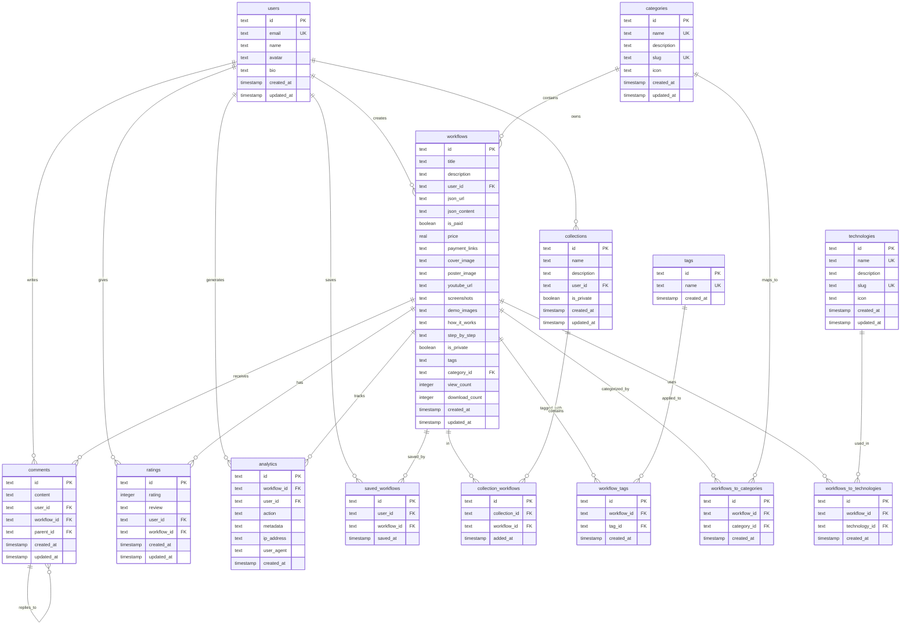

# Database Schema

## 🗄️ Database Overview

wrkflow uses **Cloudflare D1**, a serverless SQLite database, managed through **Drizzle ORM** for type-safe database operations. The schema is designed to support a comprehensive workflow marketplace with user management, content organization, and analytics.

## 📊 Entity Relationship Diagram



## 📋 Table Definitions

### 👤 Users Table

**Purpose**: Store user account information and profiles

```sql
CREATE TABLE users (
    id TEXT PRIMARY KEY,
    email TEXT NOT NULL UNIQUE,
    name TEXT,
    avatar TEXT,
    bio TEXT,
    created_at INTEGER NOT NULL,
    updated_at INTEGER NOT NULL
);
```

**Fields**:
- `id`: Unique identifier (nanoid)
- `email`: User's email address (unique)
- `name`: Display name
- `avatar`: Profile picture URL
- `bio`: User biography/description
- `created_at`: Account creation timestamp
- `updated_at`: Last profile update timestamp

**Indexes**:
- Primary key on `id`
- Unique index on `email`

### 🏷️ Categories Table

**Purpose**: Organize workflows by industry/use case categories

```sql
CREATE TABLE categories (
    id TEXT PRIMARY KEY,
    name TEXT NOT NULL UNIQUE,
    description TEXT,
    slug TEXT NOT NULL UNIQUE,
    icon TEXT,
    created_at INTEGER NOT NULL,
    updated_at INTEGER NOT NULL
);
```

**Fields**:
- `id`: Unique identifier
- `name`: Category display name
- `description`: Category description
- `slug`: URL-friendly identifier
- `icon`: Icon identifier/URL
- `created_at`: Creation timestamp
- `updated_at`: Last update timestamp

**Example Categories**:
- Marketing Automation
- Sales Processes
- Data Processing
- Customer Support
- E-commerce
- Social Media
- Finance & Accounting

### 🛠️ Technologies Table

**Purpose**: Track technologies and integrations used in workflows

```sql
CREATE TABLE technologies (
    id TEXT PRIMARY KEY,
    name TEXT NOT NULL UNIQUE,
    description TEXT,
    slug TEXT NOT NULL UNIQUE,
    icon TEXT,
    created_at INTEGER NOT NULL,
    updated_at INTEGER NOT NULL
);
```

**Fields**:
- `id`: Unique identifier
- `name`: Technology name
- `description`: Technology description
- `slug`: URL-friendly identifier
- `icon`: Icon identifier/URL

**Example Technologies**:
- Slack, Discord, Microsoft Teams
- Gmail, Outlook, SendGrid
- Shopify, WooCommerce, Stripe
- Salesforce, HubSpot, Pipedrive
- OpenAI, Google AI, Anthropic

### 🔄 Workflows Table

**Purpose**: Store workflow metadata, content, and settings

```sql
CREATE TABLE workflows (
    id TEXT PRIMARY KEY,
    title TEXT NOT NULL,
    description TEXT NOT NULL,
    user_id TEXT NOT NULL REFERENCES users(id),
    json_url TEXT,
    json_content TEXT,
    is_paid BOOLEAN NOT NULL DEFAULT FALSE,
    price REAL,
    payment_links TEXT,
    cover_image TEXT,
    poster_image TEXT,
    youtube_url TEXT,
    screenshots TEXT,
    demo_images TEXT,
    how_it_works TEXT,
    step_by_step TEXT,
    is_private BOOLEAN NOT NULL DEFAULT FALSE,
    tags TEXT,
    category_id TEXT REFERENCES categories(id),
    view_count INTEGER NOT NULL DEFAULT 0,
    download_count INTEGER NOT NULL DEFAULT 0,
    created_at INTEGER NOT NULL,
    updated_at INTEGER NOT NULL
);
```

**Fields**:
- `id`: Unique identifier
- `title`: Workflow title
- `description`: Short description
- `user_id`: Creator's user ID (foreign key)
- `json_url`: External URL to N8N JSON file
- `json_content`: Direct N8N JSON content
- `is_paid`: Whether workflow requires payment
- `price`: Price in cents (if paid)
- `payment_links`: JSON object with payment URLs
- `cover_image`: Thumbnail image URL
- `poster_image`: Large preview image URL
- `youtube_url`: Demo video URL
- `screenshots`: JSON array of screenshot URLs
- `demo_images`: JSON array of demo image URLs
- `how_it_works`: Markdown explanation
- `step_by_step`: Markdown step-by-step guide
- `is_private`: Visibility setting
- `tags`: JSON array of tag strings
- `category_id`: Associated category (foreign key)
- `view_count`: Number of views
- `download_count`: Number of downloads
- `created_at`: Creation timestamp
- `updated_at`: Last modification timestamp

**Indexes**:
- Primary key on `id`
- Index on `user_id`
- Index on `category_id`
- Index on `is_private`
- Index on `created_at`
- Index on `view_count`

### 📚 Collections Table

**Purpose**: User-created workflow collections/playlists

```sql
CREATE TABLE collections (
    id TEXT PRIMARY KEY,
    name TEXT NOT NULL,
    description TEXT,
    user_id TEXT NOT NULL REFERENCES users(id),
    is_private BOOLEAN NOT NULL DEFAULT FALSE,
    created_at INTEGER NOT NULL,
    updated_at INTEGER NOT NULL
);
```

**Fields**:
- `id`: Unique identifier
- `name`: Collection name
- `description`: Collection description
- `user_id`: Owner's user ID
- `is_private`: Visibility setting

### 🏷️ Tags Table

**Purpose**: Store reusable tags for workflow categorization

```sql
CREATE TABLE tags (
    id TEXT PRIMARY KEY,
    name TEXT NOT NULL UNIQUE,
    created_at INTEGER NOT NULL
);
```

**Fields**:
- `id`: Unique identifier
- `name`: Tag name (unique)
- `created_at`: Creation timestamp

**Example Tags**:
- automation, integration, ai, api, webhook, database, crm, email, social-media, analytics

### 💬 Comments Table

**Purpose**: User comments and discussions on workflows

```sql
CREATE TABLE comments (
    id TEXT PRIMARY KEY,
    content TEXT NOT NULL,
    user_id TEXT NOT NULL REFERENCES users(id),
    workflow_id TEXT NOT NULL REFERENCES workflows(id) ON DELETE CASCADE,
    parent_id TEXT REFERENCES comments(id),
    created_at INTEGER NOT NULL,
    updated_at INTEGER NOT NULL
);
```

**Fields**:
- `id`: Unique identifier
- `content`: Comment text
- `user_id`: Commenter's user ID
- `workflow_id`: Associated workflow ID
- `parent_id`: Parent comment ID (for replies)
- `created_at`: Creation timestamp
- `updated_at`: Last edit timestamp

### ⭐ Ratings Table

**Purpose**: User ratings and reviews for workflows

```sql
CREATE TABLE ratings (
    id TEXT PRIMARY KEY,
    rating INTEGER NOT NULL,
    review TEXT,
    user_id TEXT NOT NULL REFERENCES users(id),
    workflow_id TEXT NOT NULL REFERENCES workflows(id) ON DELETE CASCADE,
    created_at INTEGER NOT NULL,
    updated_at INTEGER NOT NULL
);
```

**Fields**:
- `id`: Unique identifier
- `rating`: Star rating (1-5)
- `review`: Optional review text
- `user_id`: Reviewer's user ID
- `workflow_id`: Rated workflow ID
- `created_at`: Creation timestamp
- `updated_at`: Last edit timestamp

**Constraints**:
- `rating` must be between 1 and 5
- Unique constraint on (`user_id`, `workflow_id`)

### 📊 Analytics Table

**Purpose**: Track user interactions and workflow usage

```sql
CREATE TABLE analytics (
    id TEXT PRIMARY KEY,
    workflow_id TEXT NOT NULL REFERENCES workflows(id) ON DELETE CASCADE,
    user_id TEXT REFERENCES users(id),
    action TEXT NOT NULL,
    metadata TEXT,
    ip_address TEXT,
    user_agent TEXT,
    created_at INTEGER NOT NULL
);
```

**Fields**:
- `id`: Unique identifier
- `workflow_id`: Associated workflow ID
- `user_id`: User ID (nullable for anonymous events)
- `action`: Action type (view, download, share, etc.)
- `metadata`: JSON metadata for additional context
- `ip_address`: User's IP address
- `user_agent`: User's browser information
- `created_at`: Event timestamp

**Action Types**:
- `view`: Workflow page viewed
- `download`: Workflow JSON downloaded
- `share`: Workflow shared
- `bookmark`: Workflow bookmarked
- `purchase`: Workflow purchased

### 📑 Junction Tables

#### Saved Workflows
```sql
CREATE TABLE saved_workflows (
    id TEXT PRIMARY KEY,
    user_id TEXT NOT NULL REFERENCES users(id),
    workflow_id TEXT NOT NULL REFERENCES workflows(id),
    saved_at INTEGER NOT NULL
);
```

#### Collection Workflows
```sql
CREATE TABLE collection_workflows (
    id TEXT PRIMARY KEY,
    collection_id TEXT NOT NULL REFERENCES collections(id),
    workflow_id TEXT NOT NULL REFERENCES workflows(id),
    added_at INTEGER NOT NULL
);
```

#### Workflow Tags
```sql
CREATE TABLE workflow_tags (
    id TEXT PRIMARY KEY,
    workflow_id TEXT NOT NULL REFERENCES workflows(id) ON DELETE CASCADE,
    tag_id TEXT NOT NULL REFERENCES tags(id) ON DELETE CASCADE,
    created_at INTEGER NOT NULL
);
```

#### Workflows to Categories
```sql
CREATE TABLE workflows_to_categories (
    id TEXT PRIMARY KEY,
    workflow_id TEXT NOT NULL REFERENCES workflows(id) ON DELETE CASCADE,
    category_id TEXT NOT NULL REFERENCES categories(id) ON DELETE CASCADE,
    created_at INTEGER NOT NULL
);
```

#### Workflows to Technologies
```sql
CREATE TABLE workflows_to_technologies (
    id TEXT PRIMARY KEY,
    workflow_id TEXT NOT NULL REFERENCES workflows(id) ON DELETE CASCADE,
    technology_id TEXT NOT NULL REFERENCES technologies(id) ON DELETE CASCADE,
    created_at INTEGER NOT NULL
);
```

## 🔗 Relationships

### One-to-Many Relationships
- **User → Workflows**: One user can create many workflows
- **User → Collections**: One user can create many collections
- **User → Comments**: One user can write many comments
- **User → Ratings**: One user can rate many workflows
- **Category → Workflows**: One category can contain many workflows
- **Workflow → Comments**: One workflow can have many comments
- **Workflow → Ratings**: One workflow can have many ratings

### Many-to-Many Relationships
- **Workflows ↔ Tags**: Many workflows can have many tags
- **Workflows ↔ Technologies**: Many workflows can use many technologies
- **Collections ↔ Workflows**: Many collections can contain many workflows
- **Users ↔ Workflows** (Saved): Many users can save many workflows

## 📈 Data Access Patterns

### Common Queries

#### 1. Get Workflows with Filters
```typescript
// Get public workflows with category and search filters
const workflows = await db
  .select({
    id: workflows.id,
    title: workflows.title,
    description: workflows.description,
    userName: users.name,
    categoryName: categories.name,
  })
  .from(workflows)
  .leftJoin(users, eq(workflows.userId, users.id))
  .leftJoin(categories, eq(workflows.categoryId, categories.id))
  .where(
    and(
      eq(workflows.isPrivate, false),
      like(workflows.title, `%${searchTerm}%`)
    )
  )
  .orderBy(desc(workflows.createdAt))
  .limit(20);
```

#### 2. Get User Dashboard Data
```typescript
// Get user's workflows with statistics
const userStats = await db
  .select({
    totalViews: sum(workflows.viewCount),
    totalDownloads: sum(workflows.downloadCount),
    workflowCount: count(workflows.id)
  })
  .from(workflows)
  .where(eq(workflows.userId, userId));
```

#### 3. Get Workflow with Relations
```typescript
// Get workflow with tags, category, and creator info
const workflow = await db
  .select()
  .from(workflows)
  .leftJoin(users, eq(workflows.userId, users.id))
  .leftJoin(categories, eq(workflows.categoryId, categories.id))
  .where(eq(workflows.id, workflowId));
```

### Performance Considerations

#### Indexes
```sql
-- Essential indexes for performance
CREATE INDEX idx_workflows_user_id ON workflows(user_id);
CREATE INDEX idx_workflows_category_id ON workflows(category_id);
CREATE INDEX idx_workflows_created_at ON workflows(created_at);
CREATE INDEX idx_workflows_view_count ON workflows(view_count);
CREATE INDEX idx_workflows_is_private ON workflows(is_private);
CREATE INDEX idx_analytics_workflow_id ON analytics(workflow_id);
CREATE INDEX idx_analytics_created_at ON analytics(created_at);
```

#### Query Optimization
- Use pagination for large result sets
- Implement proper JOIN strategies
- Cache frequently accessed data
- Use partial indexes where appropriate

## 🔄 Migration Strategy

### Database Migrations
Managed through Drizzle Kit:

```bash
# Generate migration
npm run db:generate

# Apply migrations
npm run db:migrate

# Check migration status
npm run db:status
```

### Schema Evolution
1. **Additive Changes**: Add new tables/columns without breaking existing code
2. **Non-Breaking Changes**: Modify constraints, add indexes
3. **Breaking Changes**: Require careful migration planning and rollback strategies

## 🛡️ Data Security

### Sensitive Data
- **User Emails**: Encrypted at rest
- **Payment Information**: Not stored locally (handled by payment providers)
- **IP Addresses**: Anonymized after analytics processing

### Access Control
- **Row-Level Security**: Implemented at application level
- **Data Validation**: Input sanitization and type checking
- **Audit Trail**: All modifications tracked in analytics table

## 📊 Analytics & Monitoring

### Database Metrics
- **Query Performance**: Track slow queries
- **Storage Usage**: Monitor database size growth
- **Connection Health**: Monitor connection pool status

### Business Metrics
- **Workflow Creation Rate**: New workflows per day/week
- **User Engagement**: Views, downloads, time spent
- **Popular Categories**: Most active workflow categories
- **Creator Success**: Revenue and engagement metrics

---

This database schema provides a solid foundation for the wrkflow marketplace, supporting current features while allowing for future expansion. For implementation details, see the [API Documentation](./04-api-documentation.md).
